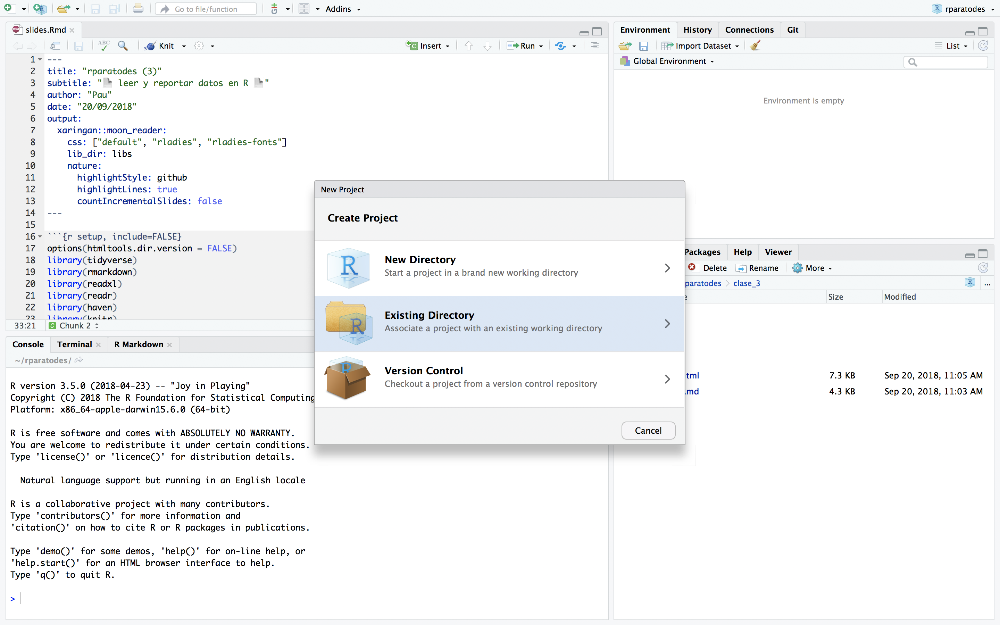
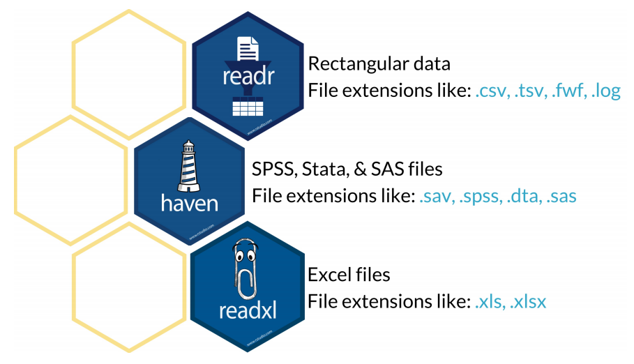
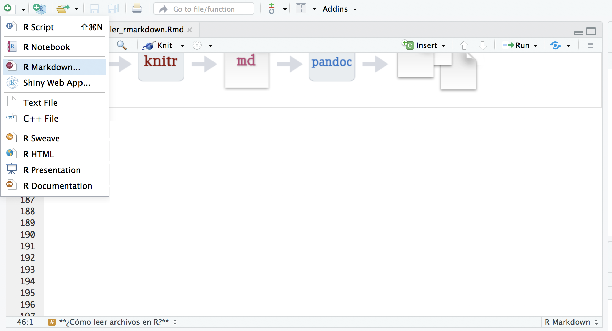
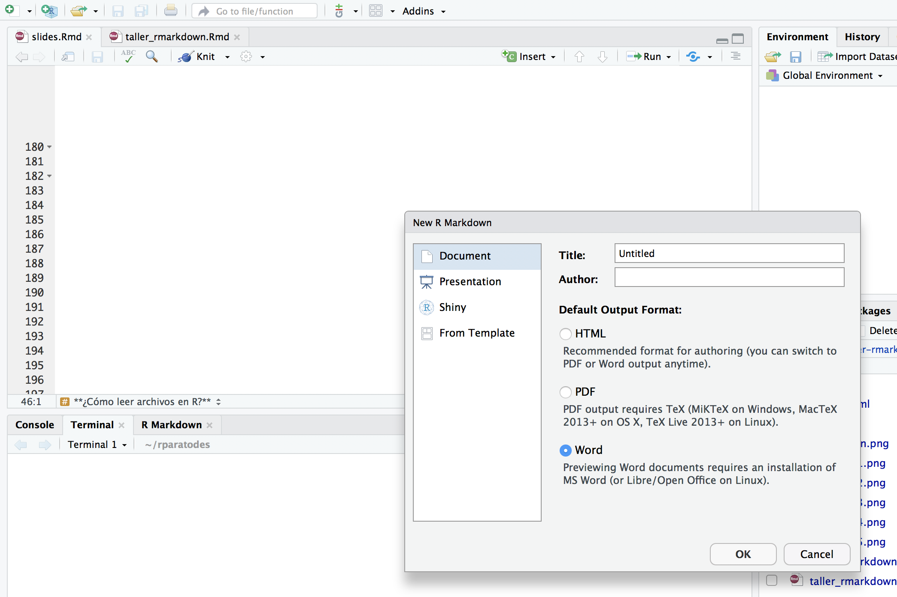

```{r setup, include=FALSE}
options(htmltools.dir.version = FALSE)
library(tidyverse)
library(rmarkdown)
library(readxl)
library(readr)
library(haven)
library(knitr)
library(here)
```

# **Flujo de trabajo orientado a proyectos**

- organizar cada proyecto como una carpeta en sus computadoras

.center[
]

---
# **Rutas**

`/home/databases/zzff` es una ruta para llegar a un directorio (como en el navegador de Windows)


R siempre tiene un directorio "actual" de trabajo

```{r}
getwd()
```

Tenemos acceso a los archivos que estan en el directorio actual, o podemos especificar una ruta desde el directorio actual hacia donde esta el archivo que queremos

.
---
- usar la función $here()$ para construir una ruta al leer o escribir archivos $\rightarrow$ crea rutas relativas al directorio sudel proyecto```{r, eval = FALSE}
install.packages('here')
library(here)
```

---
# **¿Cómo leer archivos en R?**


.center[
]

---
# **Leer archivos (1): readr**

¡sirve para leer de manera rápida y amigable **datos rectangulares** (como csv, tsv, etc.)!


```{r, eval = FALSE}
install.packages('readr')
library(readr)
```

- **read_csv()**: para leer archivos con coma (“,”) como separador
 
- **read_csv2()**: para leer archivos con punto y coma (“;”) como separador
 
- **read_tsv()**: para leer archivos con tabulador (“\t”) como separador

---

# **ejemplo: readr**
 
```{r, results = 'hide', message = F}
csv_mipymes <- read_csv(here('clase_3', 'data', 'mipyme_2016.csv'))
```

```{r}
glimpse(csv_mipymes)
```
---
# **Leer archivos (2): readxl**

¡hace más sencillo extraer datos de **Excel** y leerlos en R!


```{r, eval = FALSE}
install.packages('readxl')
library(readxl)
```

- **read_xls**: para leer archivos de extensión .xls
 
- **read_xlsx**: para leer archivos de extensión .xlsx

---

# **ejemplo: readxl**
 
```{r, results = 'hide', message = F}
xlsx_mipymes <- read_xlsx(here('clase_3', 'data', 'mipyme_2016.xlsx'))
```

```{r}
glimpse(xlsx_mipymes)
```
---
# **Leer archivos (3): haven**

¡lee archivos de **SPSS**, **SAS** y **STATA**!


```{r, eval = FALSE}
install.packages('haven')
library(haven)
```

- **read_sav**
 
- **read_spss**

- **read_dta** (también se puede usar **read.dta13** de la librería $readstata13$)

---

# **escribir archivos**
 
También con estas tres librerías se pueden guardar dataframes como archivos:

- **write_csv**

- **write_dta**

---

# **¿Qué es R Markdown?**

1) marco unificado para ciencia de datos

2) combina:
    
    - código
    
    - resultados 
    
    - comentarios en prosa 
  
3) los documentos R Markdown:
     
     - son totalmente reproducibles y automatizables
     
     - admiten muchos formatos de salida
     
---

class: center, middle    


---
#**Instalar R Markdown**

```{r, eval=FALSE}
install.packages("rmarkdown")
install.packages("knitr")
install.packages("tidyverse")

library(rmarkdown)
library(knitr)
library(tidyverse)
```
---
#**Detrás de escenas**

1) Cuando le damos `knit` al documento, R Markdown envía el archivo `.Rmd` a knitr, este ejecuta los fragmentos de código y crea un nuevo documento de formato `.md` que incluye el código y su salida

2) Este archivo generado es luego procesado por `pandoc`, que es responsable de crear el archivo terminado. 

`Ventaja flujo de trabajo de dos pasos:` ¡se puede crear una amplia gama de formatos de salida!


---

#**Sintaxis**

- `*cursiva*` y `_cursiva_`

- `**negrita**` y `__negrita__`

- `[link](www.rstudio.com)`

- `# Encabezado 1`

- `## Encabezado 2`

- `### Encabezado 3`

- imagen: ``

- ` - lista`

---
#**Código**

    1) Código incrustado: envuelvo el código con contratildes y r, R reemplaza el código 
    en línea con sus resultados
   
    2) Fragmentos de código: comienza un trozo (chunk) con ```{r} y lo termino con ```


Opción  | Efecto
------  | -------------------
include | ¿Muestra el fragmento de código de R y su resultado?
echo    | ¿Muestra el fragmento de código de R?
message | ¿Muestra los mensajes de salida?
warning | ¿Muestra las advertencias?
eval    | ¿Evalúa el fragmento de código?

---
# **¡Hagamos!**

.center[
]
---
.center[
]
---
class: center, middle

# **¡Muchas gracias!**

