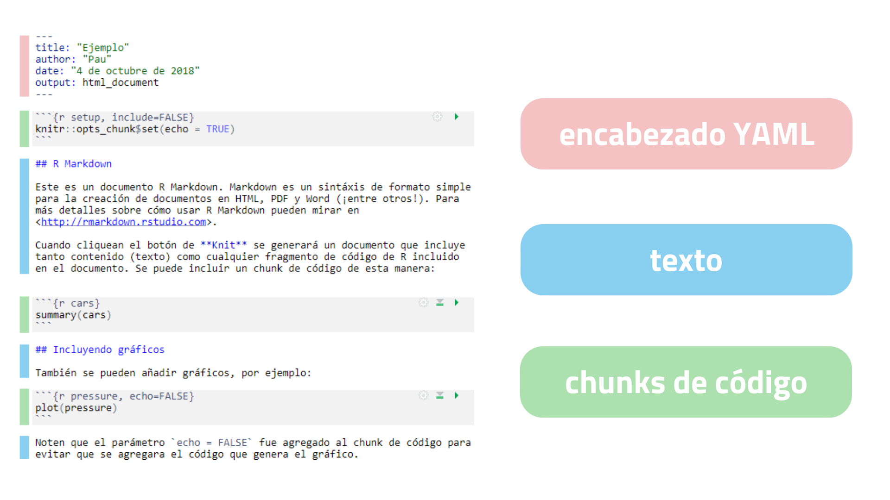

```{r setup, include=FALSE}
options(htmltools.dir.version = FALSE)
```

# **쯈u칠 es Rmarkdown?**

- **archivos .Rmd $\rightarrow$ registro de tu trabajo**: el código que necesitamos para reproducir el trabajo + la narración que un lector necesitaría para entenderlo
 
- **reproducibilidad**:cliqueando un botón, se puede reproducir el trabajo y exportar los resultados como un informe finalizado

- **documentos dinámicos**: se puede elegir exportar los informes finalizados en una variedad de formatos como html, pdf, word, etc.


---

class: center, middle


---


# **Flujo de trabajo**

1) **Abrir un nuevo archivo .Rmd** en  `File -> New File -> R Markdown`

2) **Escribir el documento**

3) **Knit al documento para crear el informe** utilizando el botón `Knit`

4) ¡Obtengo mi informe!

---
# **Estructura**


---

# **Encabezado YAML**

- Brinda **información básica** sobre el documento: título, fecha, autor, formato

- RStudio lo inserta por nosotros

- Opciones de formato de salida:

Valor Output                  | Formato de salida
----------------------------  | -------------------
output: html_document	        | archivo html (página web)
output: pdf_document	        | documento pdf
output: word_document	        | Microsoft Word .docx
output: beamer_presentation   |	presentación beamer (pdf)
output: ioslides_presentation |	presentación ioslides (html)

- Además puedo agregar: plantilla de estilo, índice, etc.

---

# **Sintaxis** 

- `*cursiva*` y `_cursiva_`

- `**negrita**` y `__negrita__`

- `[link](www.rstudio.com)`

- `# Encabezado 1`

- `## Encabezado 2`

- `### Encabezado 3`

- imagen: ``

- ` - lista`

---

# **Incluyendo código**

     1) Códido en línea: los resultados aparecen como texto sin código, lo comienzo 
     con ` r y finalizo con `

     2) Fragmentos de código: comienza un trozo (chunk) con ```{r} y lo termino con ```

```{r echo=F, out.width='50%'}
knitr::include_graphics('images/chunk.png')
```

---

class: center, middle


Opción  | Efecto
------  | -------------------
include | 쯄uestra el fragmento de código de R y su resultado?
echo    | 쯄uestra el fragmento de código de R?
message | 쯄uestra los mensajes de salida?
warning | 쯄uestra las advertencias?
eval    | 쮼valúa el fragmento de código?

---
# **Ejercicios**

    1) Convertir las líneas 8, 17, 32, 47, 62, 77 en encabezados principales (títulos)
    
    2) Convertir las líneas 21 y 26 en encabezados secundarios (subtítulos)
    
    3) Insertarle el siguiente link http://www.ine.gub.uy/encuesta-continua-de-hogares1 
    a la frase "Encuesta Continua de Hogares" en la línea 19
    
    4) Convertir el rango de líneas 28-30 en una lista
    
    5) Recordando que las funciones `names`, `nrow` y `ncol` nos brindan los nombres, 
    el número de filas y columnas de un set de datos, respectivamente, agregar código 
    en línea a la lista creada en el inciso anterior
    
    6) Mostrar los nombres de los departamentos en negrita
    
    7) Quitar los mensajes que genera el cargar las librerías en la línea 11
    
    8) Ocultar los códigos que generan tablas y dataframes 
    
    9) Con la función `kable` del paquete `kableExtra` puedo crear tablas, 
    agregue un título a la tabla generada en la línea 89
    
    10) Cambiarle el parámetro del `output` para que el formato de salida sea un 
    documento de Word y utilizar el parámetro `reference_docx: estilo-tu.docx`
    
    

---
class: center, middle

# **¡Muchas gracias y a usar Rmarkdown!**

